# ABZ 2025 Case Study

## Training and testing of agents

Setup:

```bash
python -m venv env
source env/bin/activate
pip install -r requirements.txt
```

The agent for the Highway Environment can be trained or tested via command line:

```bash
# To train a new model (save under models/highway_env):
python highway_agent.py train


# Loads the trained model and runs and renders episodes over its behaviour:
python highway_agent.py test
```


## Scenarios


In the following, we provide some scenarios for a single-agent controller.
The controlled vehicle (ego vehicle) is marked in red.
Rosa vehicles are vehicles in the same lane for which the safety distance is relevant.
Purple vehicles are vehicles for which the distance will become relevant when switching lanes.
Blue vehicles are vehicles for which the safety distance will not be relevant in the next cycle.


## Scenario 1


| 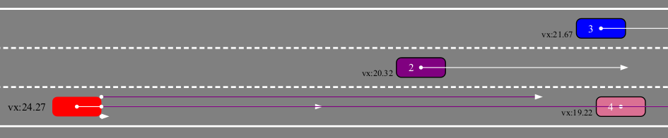                         |  | 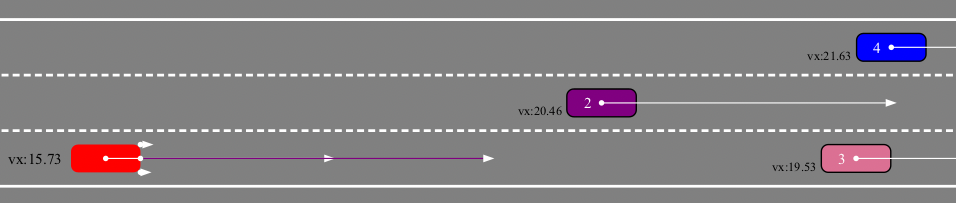 |
|--------------------------------------------------------------------------------------------|--------------------------------------------------------------------|--------------------------------------------------------------------|
| A vehicle approaches another vehicle in the same lane from behind, the distance decreases. | The Ego vehicle brakes.                                            |The Ego vehicle continues braking to maintain the safety distance. |


## Scenario 2


 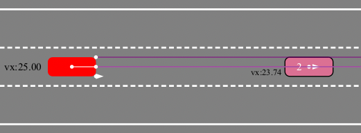                                                      | 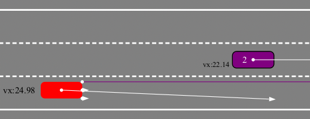        | 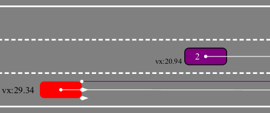                                    
|--------------------------------------------------------------------------------------------|----------------------------------------------|--------------------------------------------------------------------------|
| A vehicle approaches another vehicle in the same lane from behind, the distance decreases. | The Ego vehicle switches to the right lane.  | The Ego vehicle completes switching to the right lane and accelerates.   |


## Scenario 3

 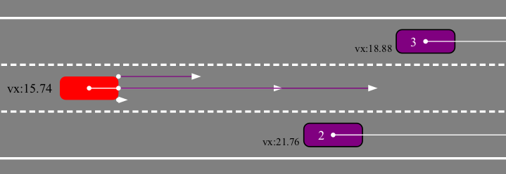                   | 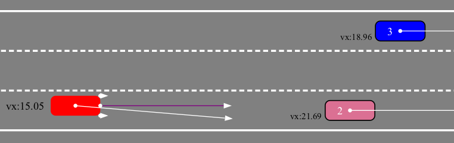                                              | 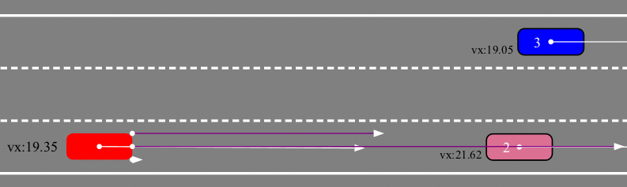       
|---------------------------------------------------------|------------------------------------------------------------------------------------|---------------------------------------------|
| There is another vehicle on another lane further right. | The Ego vehicle switches to the right lane, as the safety distance is maintained.  | The Ego  vehicle continues driving forward. |


## Scenario 4

                   |                                                        | 
|---------------------------------------------------------|---------------------------------------------------------------------------------------------|---------------------------------------------|
| There is another vehicle on another lane further right. | The Ego vehicle cannot switch to the center lane, as the safety distance is not maintained. | The Ego vehicle continues driving forward.  |


## Scenario 5

 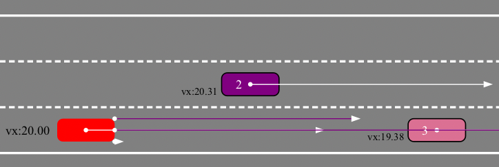         | 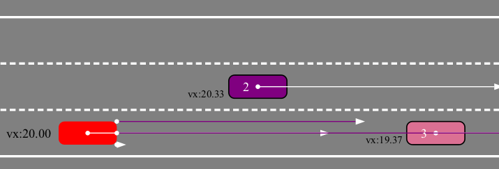           | 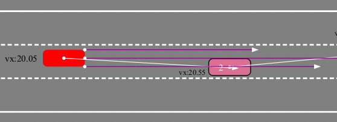                                                 
|-----------------------------------------------|-------------------------------------------------|---------------------------------------------------------------------------------------|
| The Ego Vehicle drives on the left-most lane. | There is another vehicle on the right-most lane | Both vehicles decide to switch to the center lane, while maintaining safety distances |
